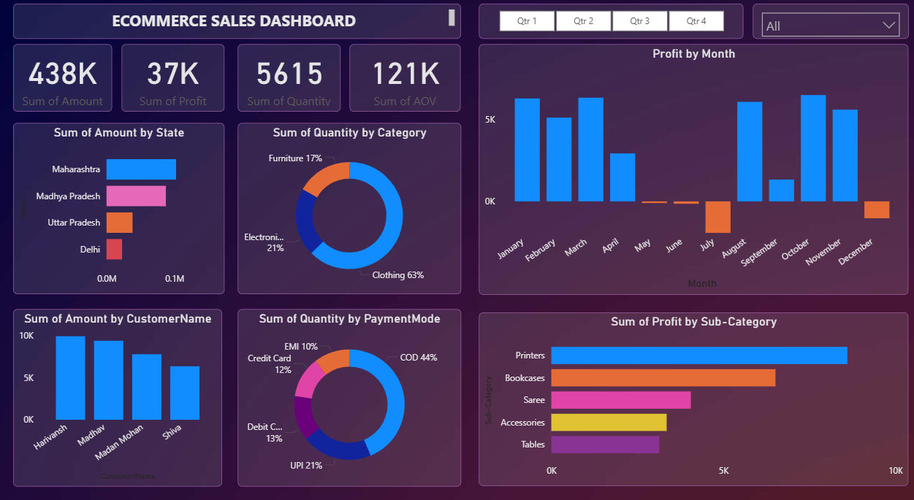

# 📊 Madhav Ecommerce Sales Dashboard | Power BI

## 📌 Project Overview
This project analyzes ecommerce sales data for **Madhav Store** using **Power BI**.
The dashboard provides interactive insights to support data-driven decisions.

## 🎯 Objectives
- Analyze sales and profit performance
- Identify top products, customers, and regions
- Understand trends across categories and payment modes

## 🛠 Tools & Skills
- Power BI
- Power Query
- DAX
- Data Visualization
- Business Intelligence

## 📊 Dashboard Features
- KPI cards for Sales, Profit, Quantity, Orders
- Interactive slicers and filters
- Category-wise and region-wise analysis
- Payment mode insights

## 📁 Files
- `.pbix` – Power BI dashboard file
- `.csv` – Ecommerce dataset
- `dashboard_preview.png` – Dashboard image

## 🚀 Future Improvements
- Sales forecasting
- Customer segmentation
- Profit analysis

## 📬 Contact
**Umar Ijaz**  
LinkedIn: www.linkedin.com/in/umar-ijaz123

